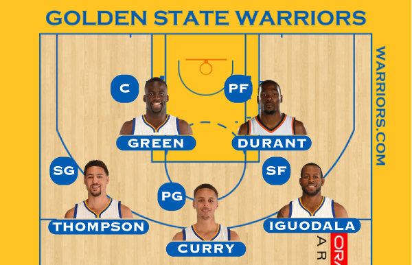
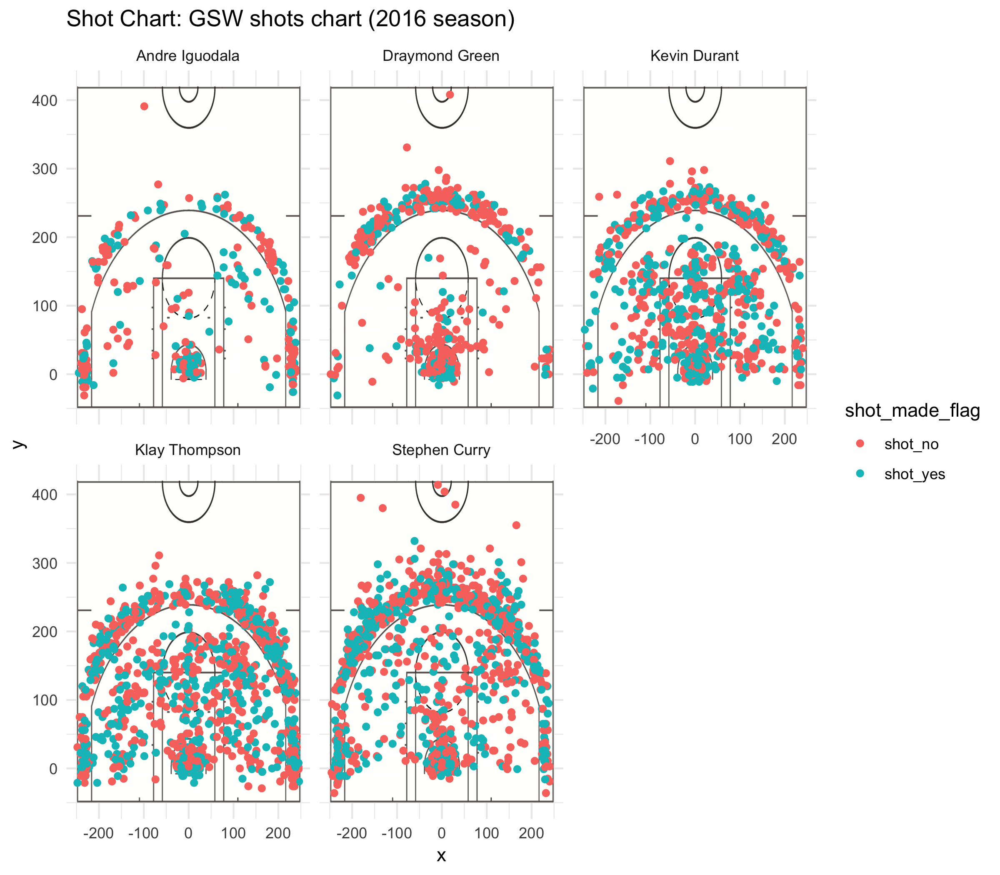

Workout01
================
Yilin Li
3/10/2019

### How Efficient are the GSW Hampton Five? --- from the perspective of scoring


#### Introduction and Motivation

The Hampton five (the former Death Lineup), known as Curry, Thompson, Green, Iguodala along with Durant, are named by a group of towns in Long Island for vacation, where they in person convinced him to sign with Golden State. Since the Warriors were significantly more efficient than most of the NBA in season 2016, we are really curious about how good were the Hampton five and the way they effect the whole team. What's more, we can not imagine what would happen if the Warriors exchange them for five league-average starting lineup (and assume leaving everything else the same)and how the team would performance. Without doubt, they would gain much less points per game. So today we are here to talk about the scoring efficency on the five star players from Golden State Warriors.

------------------------------------------------------------------------

#### Data and visualization

Our data is from <https://github.com/ucb-stat133/stat133-hws/tree/master/data>. The contents are explained in the [data dictionary](https://github.com/H4O2/workout01/blob/master/workout01/data/data-dictionary.md). First and foremost, let us have a direct perceive through the visual on the five player shots chart. Here are the positions of these five: 

And here are the shots charts for the big five in season 2016:  From the above graph, it is obvious that the splash brothers shotted more 3 the others in a high efficient way. However, Curry took more downtown 3 pointers than Klay while Klay took more corner 3s' and midranges. KD was one of the stable scoring machine. Even he could score wherever he wanted, he chose to take few long range 2 points attempt cause it is less efficiency. One offense, Green was the organizor not the main terminator, which reflects that he took much less shot attempt compared with other lineups(except Zaza). His hit ratio was not good, sometimes missing some easy layups. The zone near the basket shows that. Iguodala played as a bench leader. Therefore, he did not need to score as the lineups. His performance stage were the off-season plays!

#### Analysis and Discussion on Effective Shooting Percentage

Use the data in shots-data.csv to create three tables to summarize Effective Shooting percentages by player (import the data in your Rmd file using a relative path). All three tables should have the format of the following depicted diagram:

``` r
shotsdata <-  read.csv('../data/shots-data.csv', stringsAsFactors = FALSE)[-1]
groupdata <- group_by(shotsdata, name)
# 2 points
pts2summary <- summarise(groupdata,
  total = sum(shot_type == "2PT Field Goal" ),
  made = sum(shot_made_flag == 'shot_yes' & shot_type == "2PT Field Goal"))
pts2summary <- arrange(mutate(pts2summary, perc_made = made/total), desc(perc_made))
pts2summary
```

    # A tibble: 5 x 4
      name           total  made perc_made
      <chr>          <int> <int>     <dbl>
    1 Andre Iguodala   210   134     0.638
    2 Kevin Durant     643   390     0.607
    3 Stephen Curry    563   304     0.540
    4 Klay Thompson    640   329     0.514
    5 Draymond Green   346   171     0.494

The chart shows as the performance of 2 pointers of them. Iguodala led and KD follows. That was because they both played an important role in transition and finished really well. What's more, KD was a terrifying midrange jumper with both high attempts number and success rate. Then the splash brothers follows. The differences between them in 2 pointers are Curry finished more around the rim as Klay took more midrange jumpers and cuts. Draymond was the end on the sheet for his main function was not scoring compared with others.

``` r
# 3 points
pts3summary <- summarise(groupdata,
  total = sum(shot_type == "3PT Field Goal"),
  made = sum(shot_made_flag == 'shot_yes' & shot_type == "3PT Field Goal"))
pts3summary <- arrange(mutate(pts3summary, perc_made = made/total), desc(perc_made))
pts3summary
```

    # A tibble: 5 x 4
      name           total  made perc_made
      <chr>          <int> <int>     <dbl>
    1 Klay Thompson    580   246     0.424
    2 Stephen Curry    687   280     0.408
    3 Kevin Durant     272   105     0.386
    4 Andre Iguodala   161    58     0.360
    5 Draymond Green   232    74     0.319

In this form, without ant doubt, the splash brothers lead the board with the top two 3 points made in the league in that season. Then there follow KD and Andre with above average percentage. In comparison, Green was not a qualified shooter. And sometimes other teams used this point to make strategies against the Warriors.

``` r
# total shot summary
shotsummary <- summarise(groupdata,
  total = n(),
  made = sum(shot_made_flag == 'shot_yes'),
  TSP = (sum(shot_made_flag == 'shot_yes' & shot_type == "3PT Field Goal")*3+
    sum(shot_made_flag == 'shot_yes' & shot_type == "2PT Field Goal")*2)/n())
shotsummary <- arrange(mutate(shotsummary, perc_made = made/total), desc(perc_made))
shotsummary
```

    # A tibble: 5 x 5
      name           total  made   TSP perc_made
      <chr>          <int> <int> <dbl>     <dbl>
    1 Kevin Durant     915   495 1.20      0.541
    2 Andre Iguodala   371   192 1.19      0.518
    3 Klay Thompson   1220   575 1.14      0.471
    4 Stephen Curry   1250   584 1.16      0.467
    5 Draymond Green   578   245 0.976     0.424

To sum up both the 2 points and the 3 points, we reach a conclusion that the percentage of made them were almost the same in order of the score per attempt. The best one was KD while the difference between him and Andre is not that significant. Then follows KT and Stephen, the "true" shooting percentage of Curry was a little bit higher for he made more 3 pointers.

#### Conclusion: How GSW relies on them?

**Curry**, the MVP in season 2016, as well as the score leader and steal leader, was not only a three-pointer, but also scored 402 three-pointers in a single season, which was a "Curry" record which is difficult to break through. He has become the league's single-season three-pointer for six consecutive years till now. The shooting efficiency of him was without any need to ask, who entered the 180 club. Curry was in the first tier of shooting, stealing, organizing and all range of contributions.

**Thompson** scored the second-highest 276 three-pointers in 2016. Thompson was the second scoring champion of the Warriors in season 2015. Although he was relegated to the third scoring choice due to the coming of Durant, he still worked impressively in both 2 and 3 points. Even if the number of shots was reduced than 2015, Thompson was still one of the best shooter in the league, with consistent shooting efficiency on three-point shots.

**Durant**, the four-time scoring leader, with excellent attack ability, was the most terrifying scoring machine in the league. No need to explain more with the data we already shown. Even if he sacrificed some shots and the chance in attacking, he still scored 25 points or more in the season 2016 along with excellent shooting efficiency and remarkable defensive data.

**Green** had shown influential performance on both ends of the court for the Warriors. In the 2016 season, Durant was one of the main choices for the team to start an offense. So this have caused Green to reduce the chances of holding the ball, and the number of scoring and assisting projects was slightly lower than 2015. However, he was still an expert in block, rebounds and steals on the defensive side.

**Iguodala** was an important sixth man on the Warriors bench. He could serve as a ball-handling organizator, as well as a denfensive gate to take care of the top scorers from the other teams. And He was a competent green leaf who could bring many contributions to the team. Just staying in the offensive talented Warriors, Iguodala did not have to take on too many offensive responsibilities especially shooting in 2016 the season, which made his value of opening the space extremely limited.

#### References

[NBA stats: GSW](https://stats.nba.com/team/1610612744/?Season=2016-17)

[Wiki: death lineup](https://en.wikipedia.org/wiki/Death_Lineup)

[ARE THE WARRIORS MAKING THE MID-RANGE RELEVANT AGAIN?](https://shottracker.com/articles/are-the-warriors-making-the-mid-range-relevant-again)
